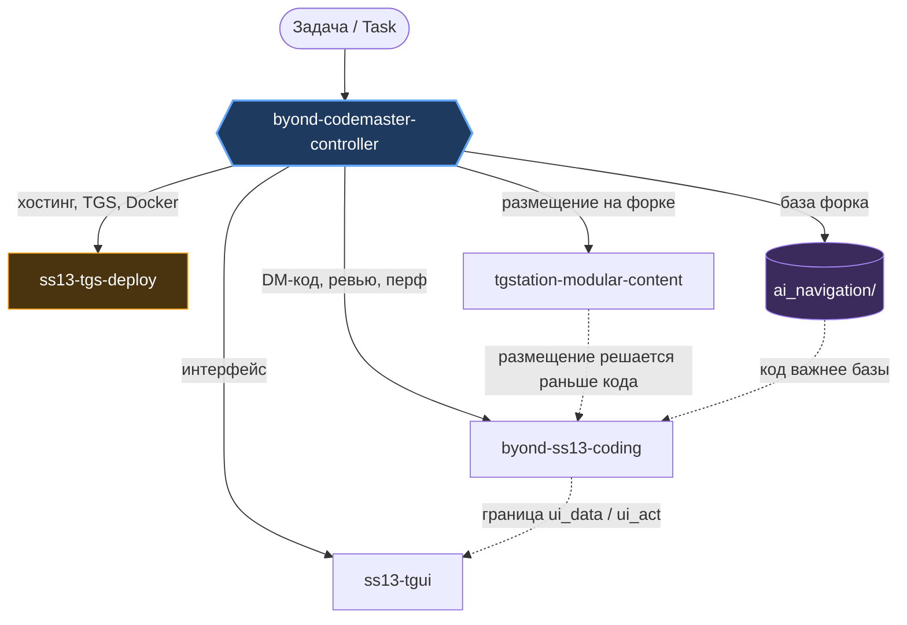

# ai-skills

[](https://github.com/PatapoIIIa/ai-skills/actions/workflows/skill-truth.yml)

Набор ИИ-скиллов для работы с SS13 / BYOND, распространяемый как **плагин Claude Code**. Подписался один раз — дальше обновления приходят сами. Скиллы предоставляются «как есть», вы их используете на свой страх и риск.

A set of AI skills for SS13 / BYOND work, distributed as a **Claude Code plugin**. Subscribe once; updates follow automatically. Provided "as is" — use at your own risk.

## Установка / Install

```bash
claude plugin marketplace add PatapoIIIa/ai-skills
```

```bash
claude plugin install ss13-byond@ss13-ai-skills
```

Внутри Claude Code — то же самое через `/plugin marketplace add PatapoIIIa/ai-skills`, затем `/plugin install ss13-byond@ss13-ai-skills`. **Слэш-команда `/plugin` есть не везде** — см. раздел «Если `/plugin` недоступен» ниже.

**Про обновления.** В манифесте намеренно не задано поле `version`: версией считается git SHA, поэтому вы всегда получаете актуальный коммит ветки по умолчанию — без ручного повышения версий с моей стороны. Как обновиться — раздел ниже.

*On updates: `version` is deliberately omitted from the manifest, so the git SHA acts as the version and you always track the default branch's latest commit. How to update — see below.*

## Обновление / Updating

```bash
claude plugin marketplace update ss13-ai-skills
claude plugin update ss13-byond@ss13-ai-skills
```

Внутри Claude Code — `/plugin marketplace update ss13-ai-skills`, затем `/plugin update ss13-byond@ss13-ai-skills`. Первая команда обновляет каталог маркетплейса, вторая ставит новую версию плагина — нужны обе. Автоматически, без этих команд, обновление не приходит.

*Inside Claude Code — `/plugin marketplace update ss13-ai-skills`, then `/plugin update ss13-byond@ss13-ai-skills`. The first refreshes the marketplace catalog, the second installs the new plugin version — both are required. Nothing updates automatically without running them.*

### Если `/plugin` недоступен / When `/plugin` is unavailable

В части сред (десктоп-приложение и другие не-терминальные поверхности) слэш-команда отвечает `/plugin isn't available in this environment`. Плагин тут ни при чём: **работает ровно тот же CLI**, ему просто нужен настоящий шелл.

- Есть терминал — выполните команды `claude plugin ...` выше как есть, этого достаточно.
- Терминала нет — нужен любой инструмент, умеющий запускать shell-команды. Например MCP-сервер [Desktop Commander](https://github.com/wonderwhy-er/DesktopCommanderMCP): попросите ассистента выполнить через него `claude plugin marketplace update ss13-ai-skills`, затем `claude plugin update ss13-byond@ss13-ai-skills`.

Проверить результат: `claude plugin list` — у `ss13-byond@ss13-ai-skills` в поле Version стоит git SHA, и он должен совпадать с последним коммитом ветки по умолчанию.

*In some environments (the desktop app and other non-terminal surfaces) the slash command answers `/plugin isn't available in this environment`. Nothing is wrong with the plugin: **the same CLI works**, it just needs a real shell.*

*If you have a terminal, the `claude plugin ...` commands above are all you need. If you do not, use anything that can run shell commands for you — for example the [Desktop Commander](https://github.com/wonderwhy-er/DesktopCommanderMCP) MCP server — and have it run those same commands. Verify with `claude plugin list`: the Version field for `ss13-byond@ss13-ai-skills` is a git SHA and should match the latest commit on the default branch.*

## Дерево зависимостей / Dependency tree

Один контроллер маршрутизирует задачу; архитектурные скиллы не знают друг о друге и не дублируют логику маршрутизации.



Сплошные стрелки — маршрутизация (кто выполняет). Пунктирные — отношения между скиллами: `byond-ss13-coding` отдаёт всё за границей `ui_data`/`ui_act` в `ss13-tgui`; `tgstation-modular-content` решает *куда положить* раньше, чем другие решают *что написать*; семантическая база — подсказка для навигации, код всегда важнее.

*Solid edges = routing (who implements). Dashed = inter-skill contracts: the DM skill hands everything past the `ui_data`/`ui_act` boundary to the TGUI skill; placement is decided before implementation; a semantic base is a routing aid that never outranks code.*

## Что внутри / What's inside

| Скилл | Роль |
|---|---|
| `byond-codemaster-controller` | Маршрутизация (два гейта), контракт взаимодействия, жизненный цикл семантических баз |
| `byond-ss13-coding` | DM-семантика, архитектура SS13, производительность, ревью — авторитет по инвариантам движка |
| `ss13-tgui` | TGUI-интерфейсы, мост ByondUi, разбор проблем клиента |
| `tgstation-modular-content` | Размещение контента на форках, переживающее upstream sync |
| `ss13-tgs-deploy` | Развёртывание сервера через TGS/Docker — ось операций, вне стека кода |

- Документация (RU): [docs/skills-guide.ru.md](docs/skills-guide.ru.md)
- Documentation (EN): [docs/skills-guide.en.md](docs/skills-guide.en.md)
- Метрики и тесты (RU): [docs/benchmarks.ru.md](docs/benchmarks.ru.md)
- Benchmarks & tests (EN): [docs/benchmarks.en.md](docs/benchmarks.en.md)

Папки `ai_navigation_*` в корне — это семантические базы конкретных форков (данные, не скиллы). Они **не входят в плагин** и подписчикам не поставляются.

## Проверка истинности / Truth checks

Скиллы утверждают факты о реальных репозиториях: где лежит модульный контент, как выглядит тег правки, на какой версии `tgui-core` проверено поведение. Эти факты протухают молча. В репозитории есть три проверки, две из которых гоняются в CI еженедельно — бейдж выше показывает их состояние.

*The skills assert facts about real repositories — where modular content lives, how an edit tag reads, which `tgui-core` a behaviour was verified against. Such facts expire silently. Three checks guard them; two run weekly in CI, and the badge above is their state.*

| Проверка / Check | Что читает / Reads | Что значит красный / A failure means |
|---|---|---|
| `validate_ecosystem.py` | только этот репозиторий / this repo only | репозиторий противоречит сам себе / the repo contradicts itself |
| `check_versions.py` | 6 upstream'ов по HTTPS / 6 upstreams over HTTPS | апстрим двинул пин / an upstream moved a pin |
| `verify_claims.py --source upstream` | канонические репозитории через GitHub API | путь или конвенция исчезли / a path or convention is gone |
| `verify_claims.py` (локально / local) | клоны на машине; в CI не гоняется / local clones, not run in CI | то же, плюс grep-проверки / same, plus the grep checks |

Актуальные цифры — в бейдже и в таблице ниже; они обновляются сами, поэтому здесь не дублируются.

*Live numbers are in the badge and the auto-updated table below, so they are not duplicated here.*

**Отслеживаемые upstream'ы / Watched upstreams:** [tgstation](https://github.com/tgstation/tgstation), [Bubberstation](https://github.com/Bubberstation/Bubberstation), [cmss13](https://github.com/cmss13-devs/cmss13), [Vanderlin](https://github.com/Monkestation/Vanderlin), [Ratwood-2.0](https://github.com/Rotwood-Vale/Ratwood-2.0), [Azure-Peak](https://github.com/Azure-Peak/Azure-Peak) — из `dependencies.sh` и `tgui/packages/tgui/package.json`.

<!-- versions:start -->

<!-- Generated by scripts/render_version_table.py. Do not edit by hand; the workflow overwrites it. -->

**Версия в скилле против реальной / Skill's version vs reality** — обновлено 2026-09-02 / updated 2026-09-02

| | Пин / Pin | В скилле / Skill records | Реально / Actual | Репозиторий / Repository | Скилл / Skill |
|---|---|---|---|---|---|
| ⚠️ | `tgui-core` | 5.6.0 / 6.1.1 | `^4.2.3` | [Rotwood-Vale/Ratwood-2.0](https://github.com/Rotwood-Vale/Ratwood-2.0) | `ss13-tgui` |
| ✅ | `BYOND_MINOR` | 1661 | `1661` | [Monkestation/Vanderlin](https://github.com/Monkestation/Vanderlin) | `ss13-tgs-deploy` |
| ✅ | `RUST_G_VERSION` | 6.1.0 | `6.1.0` | [Monkestation/Vanderlin](https://github.com/Monkestation/Vanderlin) | `ss13-tgs-deploy` |
| ✅ | `tgui-core` | 5.6.0 / 6.1.1 | `^6.1.1` | [Azure-Peak/Azure-Peak](https://github.com/Azure-Peak/Azure-Peak) | `ss13-tgui` |
| ✅ | `tgui-core` | 5.6.0 / 6.1.1 | `^6.1.1` | [Bubberstation/Bubberstation](https://github.com/Bubberstation/Bubberstation) | `ss13-tgui` |
| ✅ | `tgui-core` | 5.6.0 / 6.1.1 | `^5.6.0` | [Monkestation/Vanderlin](https://github.com/Monkestation/Vanderlin) | `ss13-tgui` |
| ✅ | `tgui-core` | 5.6.0 / 6.1.1 | `^6.1.1` | [tgstation/tgstation](https://github.com/tgstation/tgstation) | `ss13-tgui` |

⚠️ — реальная версия вне того, на чём проверялся скилл: утверждение не опровергнуто, но его доказательство просрочено и требует перечитывания.

*⚠️ means the live version sits outside what the skill was verified against: the claim is not disproved, its evidence has expired.*

**Что реально стоит в апстримах / What the upstreams actually pin**

| Репозиторий / Repository | BYOND | rust-g | Bun | tgui-core | react |
|---|---|---|---|---|---|
| [tgstation/tgstation](https://github.com/tgstation/tgstation) | `516.1685` | `6.2.0` | `1.3.5` | `^6.1.1` | `^19.1.0` |
| [Rotwood-Vale/Ratwood-2.0](https://github.com/Rotwood-Vale/Ratwood-2.0) | `516.1673` | `master` | `1.2.16` | `^4.2.3` | `^19.1.0` |
| [Monkestation/Vanderlin](https://github.com/Monkestation/Vanderlin) | `516.1661` | `6.1.0` | `1.3.5` | `^5.6.0` | `^19.1.0` |
| [Azure-Peak/Azure-Peak](https://github.com/Azure-Peak/Azure-Peak) | `516.1687` | `3.9.0` | `1.3.14` | `^6.1.1` | `^19.2.8` |
| [Bubberstation/Bubberstation](https://github.com/Bubberstation/Bubberstation) | `516.1659` | `6.2.0` | `1.3.5` | `^6.1.1` | `^19.1.0` |
| [cmss13-devs/cmss13](https://github.com/cmss13-devs/cmss13) | `516.1687` | `7.0.0` | `1.3.5` | — | `^18.3.1` |

Единой «текущей» версии в этом семействе нет — никогда не переносите версию из гайда одного форка в другой, читайте `dependencies.sh` цели.

*There is no single "current" version in this family. Never carry a version from one fork's guide into another; read the target's own `dependencies.sh`.*

<!-- versions:end -->

Единственный `DRIFT` — не поломка: на форке со сжатой историей (32 коммита) эвристика «какой модульный корень живой» объективно не работает, и скилл теперь честно велит в таком случае спросить, а не угадывать.

*The one `DRIFT` is not a defect: on a fork with a squashed 32-commit history the "which modular root is live" heuristic genuinely cannot decide, and the skill now says to ask rather than guess.*

**Что проверки НЕ покрывают / Not covered:** факты о семантике движка BYOND (тир 1) проверяются по официальному DM Reference вручную — ни один из скриптов их не трогает. Версии читаются только из upstream: локальные клоны для этого не годятся (один отставал на 1039 коммитов). Подробности — в `CLAUDE.md`.

*Engine-semantics facts (tier 1) are verified by hand against the official DM Reference; no script touches them. Versions are read from upstream only — local clones proved unfit (one was 1039 commits behind).*

## Метрики / Benchmarks

Численный A/B-тест `byond-ss13-coding`: одна и та же задача, параллельно, одна и та же модель — с скиллом и без. Полная методология и ограничения: [docs/benchmarks.ru.md](docs/benchmarks.ru.md) / [docs/benchmarks.en.md](docs/benchmarks.en.md).

Numeric A/B test of `byond-ss13-coding`: same task, in parallel, same model — with the skill vs. without. Full methodology and limitations: [docs/benchmarks.en.md](docs/benchmarks.en.md) / [docs/benchmarks.ru.md](docs/benchmarks.ru.md).

**Track A — code review, 9 planted defects / Трек A — код-ревью, 9 заложенных дефектов**

| Metric / Метрика | With skill / Со скиллом | Without / Без скилла |
|---|---|---|
| Defects found / Найдено дефектов | **9 / 9 (100%)** | 8 / 9 (89%) |
| False positives / Ложные срабатывания | 0 | 0 |
| Tokens / Токены | 70,500 | 44,400 |
| Time / Время | 201 s | 128 s |

**Track B — engine-fact quiz, 10 questions / Трек B — квиз по фактам движка, 10 вопросов**

| Metric / Метрика | With skill / Со скиллом | Without / Без скилла |
|---|---|---|
| Correct / Верных ответов | **10 / 10** | 7.5 / 10 |
| Tokens / Токены | 46,200 | 37,100 |
| Time / Время | 19 s | 43 s |

**Track E — false-positive stress test (fixed patch) / Трек E — стресс-тест на ложные срабатывания (исправленный патч)**

| Metric / Метрика | With skill / Со скиллом |
|---|---|
| False positives / Ложные срабатывания | **0** |
| Nitpicks correctly rejected / Отклонённых придирок | 3 |

**Track C — independent fact audit of the skill itself / Трек C — независимый аудит фактов скилла**

| Metric / Метрика | Result / Результат |
|---|---|
| Confirmed / Подтверждено | **10 / 10** |
| Contradicted / Опровергнуто | 0 |

**4-skill linkage economy / Экономность связки 4 скиллов**

| Metric / Метрика | Value / Значение |
|---|---|
| Documents loaded / Загружено документов | 9 (of 20+ available / из 20+ доступных) |
| Routing loops / Циклов маршрутизации | 0 |
| Unused loads / Неиспользованных загрузок | 0 |

**Dollar cost @ Claude Sonnet 5 intro rates ($2/$10 per 1M in/out) / Стоимость в деньгах**

| Track / Трек | Δ tokens / Δ токенов | Est. cost / Оценка стоимости |
|---|---|---|
| A (review / ревью) | +26,100 | ~$0.05–0.10 / run |
| B (quiz / квиз) | +9,100 | ~$0.02–0.03 / run |

**Bottom line / Итог:** the skill's overhead (+25–59% tokens, a few cents per run) pays for itself on a single prevented incident — the one defect the baseline missed belongs to the most expensive bug class there is: "compiles clean, breaks live in production."

Оверхед скилла (+25–59% токенов, единицы центов за прогон) окупается уже на одном предотвращённом инциденте — единственный пропущенный baseline'ом дефект относится к самому дорогому классу ошибок: «компилируется зелёным, ломается у живых игроков».
